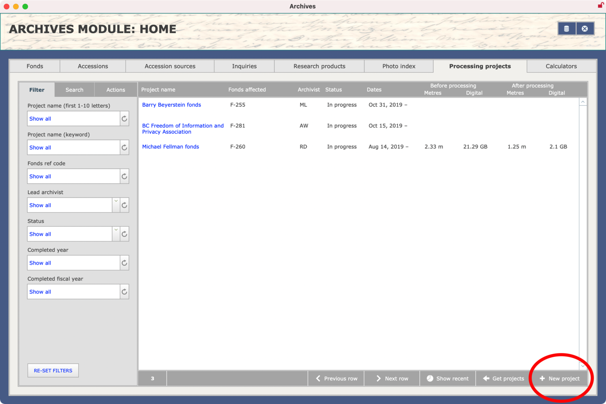
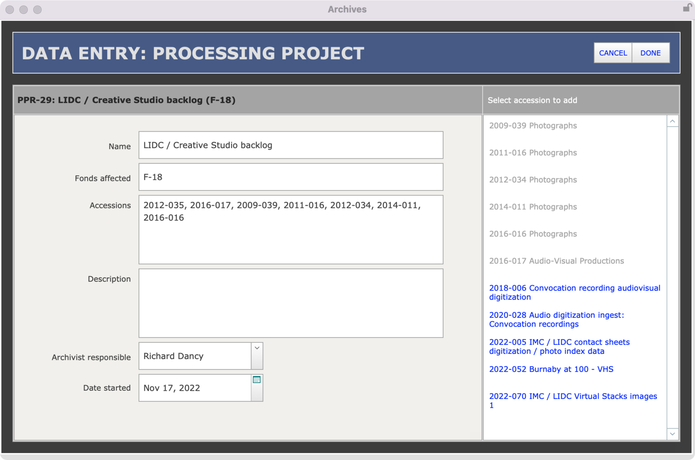

###### [AIS Documentation](../../README.md) > [Archives Module](../overview.md)
###### [Accessions](../accession/overview.md) `|` [Block Reviews](../block-review/overview.md) `|` [Fonds](../fonds/overview.md) `|` [Informal Access Reviews](../informal-access-review/overview.md) `|` [Inquiries](../inquiry/overview.md) `|` Processing Projects `|` [Research Products](../research-product/overview.md)
###### [Overview](overview.md) `|` Create new records `|` [Edit records](edit-record.md) `|` [Reports and actions](reports-actions.md) `|` [DB structure](db-structure.md)

# Processing Projects: Create Records
You can create a new `Processing Project` record from the **Archives Module Home** screen or from any Processing Project **View** or **List** screen. Either of these starting points will take you to a dedicated **Data Entry** screen.

## Create a new record

From the Archives module **Home** screen:
- Click the `Processing projects` tab.
- Click the `+ New project` button below the filter portal in the lower right corner of the screen.

From any project **View** or **List** screen:
- Click the `+` icon in the NavBar along the top of the screen.

## Data entry screen

The **Data entry** screen gives the core set of required fields for a `Processing Project` record.

`Name`
- Enter a brief descriptive name for the project.

`Fonds affected`
- List the Reference codes for fonds that are included in the project.
- If there is more than one fonds, use commas to separate values.
- Always include the F- prefix, e.g. "F-18".

`Accessions`
- List the `Accession numbers` of all `Accessions` that are included in the project.
- You can enter manually or use the sidebar list on the right to select / add `Accessions`.
- The sidebar list shows all unprocessed accessions registered to the fonds listed in the `Fonds affected` field.
- Click an `Accession` to add it to the `Accession numbers` field.
- Accessions will be greyed out in the sidebar list as they are added to the field.

`Description`
- Give a brief description of the project.

`Archivist responsible / Date started`
- Enter the name of the archivist responsible for project and the date the project began.
- Values will default to current user's name and current date on record creation.

## Complete data entry
To complete data entry, click the `Done` button in the top right corner of the screen.
- The **Data entry** window will close and you will be routed to the new record on its standard View screen.

To quit the process without creating a new record, click the `Cancel` button.
- You will be prompted to confirm your request; click `OK`.
- The **Data entry** window will close and you will be returned to your previous location in the system, no new record will be created.

---
###### Last updated: Aug 8, 2023
