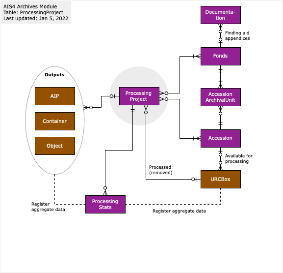

###### [AIS Documentation](../../README.md) > [Archives Module](../overview.md)
###### [Accessions](../accession/overview.md) `|` [Block Reviews](../block-review/overview.md) `|` [Fonds](../fonds/overview.md) `|` [Informal Access Reviews](../informal-access-review/overview.md) `|` [Inquiries](../inquiry/overview.md) `|` Processing Projects `|` [Research Products](../research-product/overview.md)

# Processing Project: Database Structure

A `Processing Project` is a program of work with clear start and end dates to arrange and describe archival records from the backlog of one or more related `Fonds` or `Collections`. `Processing Projects` are related to other entities throughout the AIS, but especially to entities in the [Archives](../overview.md) and [Repository](../repository-module/overview.md) modules.

Contents
1 Fonds and accessions
2 URC Boxes
3 Containers, Objects, AIPs
4 Processing stats

## Fonds and accessions
A project can be linked to multiple `Fonds` and `Accessions`; and `Fonds` and `Accessions` can in turn be associated with multiple projects over time.

Examples:
- The archivist may decide that materials donated in a single `Accession` are better arranged into multiple `Fonds`.
- The archivist processes several backlog `Accessions` from the same `Fonds` in one project.
- Different accruals from the same `Fonds` are processed separately over time.
- A single `Accession` is broken down and arranged and describe in separate projects over several years.

These many-to-many relationships are handled in the database by simple text fields (`fonds__list`, `accessions__list`) taking a comma-separated list of values (e.g. "F-200, F-205"; "2010-049, 2014-033, 2020-004").

Calculation fields (`_kflct__fondsRefCode`, `_kflct__accessionNumber`) resolve the lists into multi-value key fields with each value on a separate line, allowing links to the respective `Fonds` and `Accession` tables.

## URC Boxes
Projects dealing with analog materials will typically process records stored in `URC Boxes` already registered in the AIS as backlog.

The `Processing Project` table provides an interface for displaying all `URC Boxes` registered to the `Accessions` entered by the archivists in the `accessions__list` field.
- The archivist selects the boxes that are processed as part of the current project to register them as "removed".

Removal runs a script that updates fields across several AIS tables.

`URCBox` table:
- Changes the `identity__workflow` and `identity__lifeCycle` fields (to "Processed" and "Removed" respectively).
- Adds the ID to the `_kflxt__processingProjectID` field.
- Registers the date of removal and staff responsible (`workflow__removed_date` and `workflow__removed_by`).

`Holding` table:
- Adds the date and staff name to the current `Holding` record to close it (`remove__date` and `remove__staff`).

`Location` table:
- Sets the `identity__status` field to "Available" to free up the location for new box assignments.

## Containers, Objects, AIPs
Projects create new entities that need to be registered in the AIS:
- `Containers` for storing the rehoused materials (e.g. textual records, photographs, audiocassettes).
- `Objects` for registering analog audio and audio-visual items (e.g. audiocassettes), as well as retained digital storage devices (e.g. DVDs).
- `AIPs` for born-digital transfers and / or digitized materials processed through Archivematica.

The `ProcessingProject` table provides an interface for creating these new records and automatically linking them to the project (through the project ID).

## Processing stats
The `ProcessingStats` table aggregates analog and digital extents by type of material.

The project can have multiple entries. Each entry specifies the phase (before or after processing) and provides for a count of items, size in metres (if applicable), and digital size (if applicable).

Examples:
- 12 Archival containers (standard) = 125 cm.
- 2 optical disks = 1400 MB.
- 4 AIPs (email) = 39.4 GB.

The interface provides a button for registering inputs (`URC Boxes`) and outputs (`Containers`, `Objects`, `AIPs`) as separate entries, as well as a data entry screen for manual registration.

Based on its `ProcessingStats` entries, the project record presents a statistical comparison of extents before and after processing and percentage change.

---
###### Last updated: Aug 8, 2023
###### Processing Projects > [Overview](overview.md) `|` [Create new records](create-new-record.md) `|` [Edit records](edit-record.md) `|` [Reports and actions](reports-actions.md) `|` [DB structure](db-structure.md)
