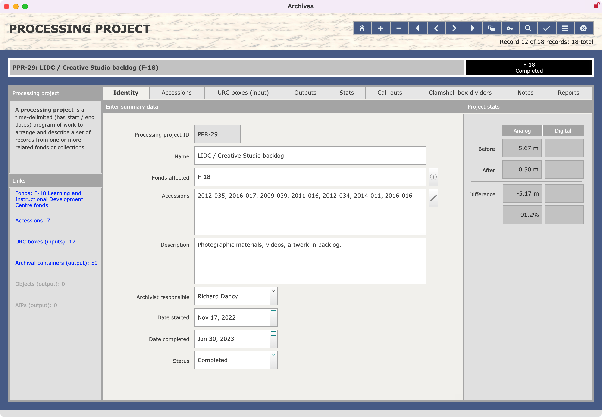
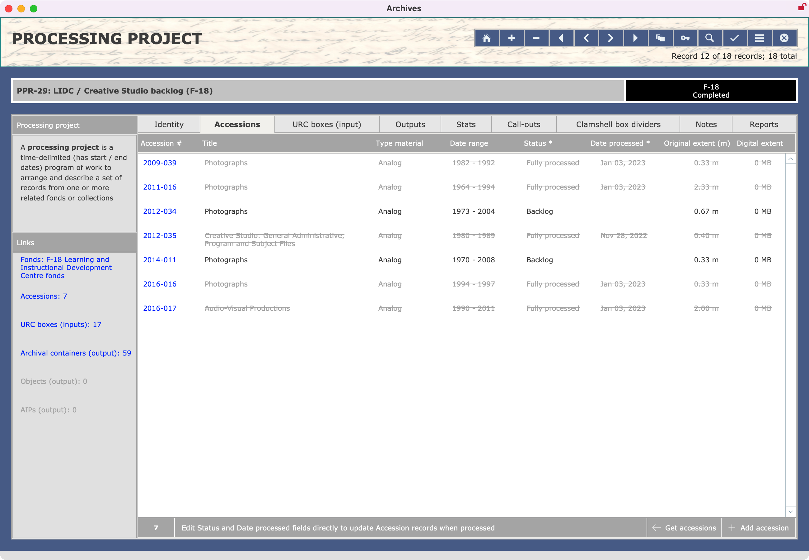
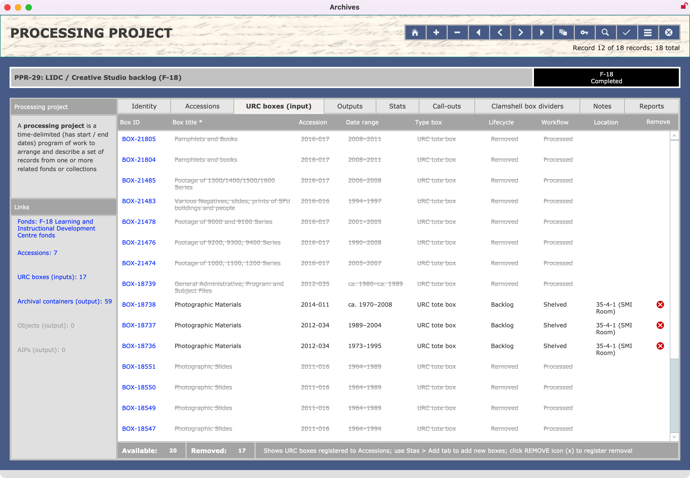
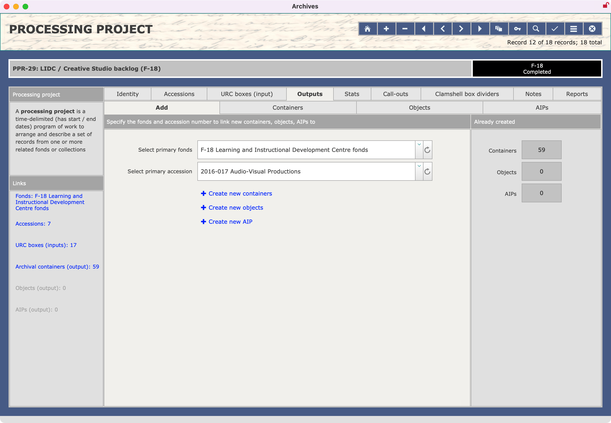
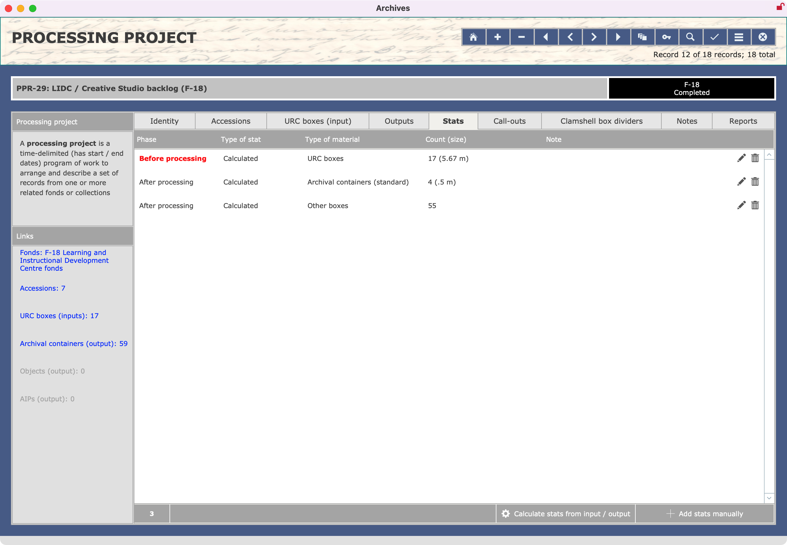
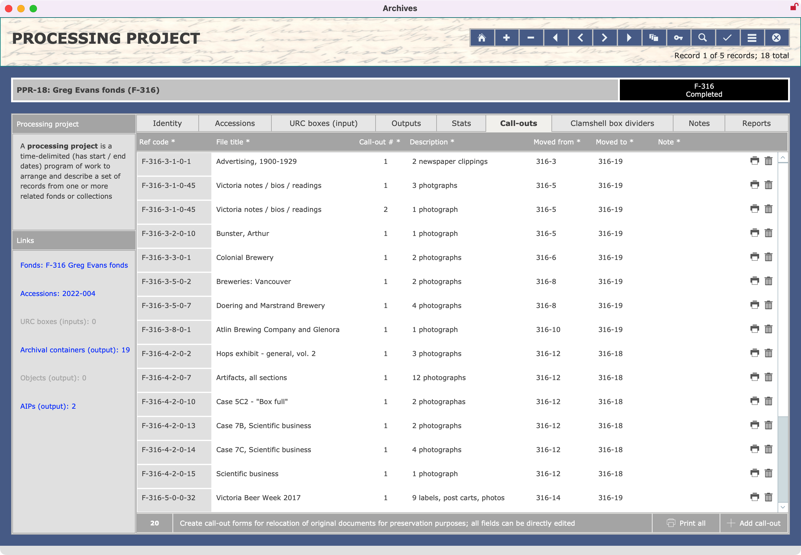
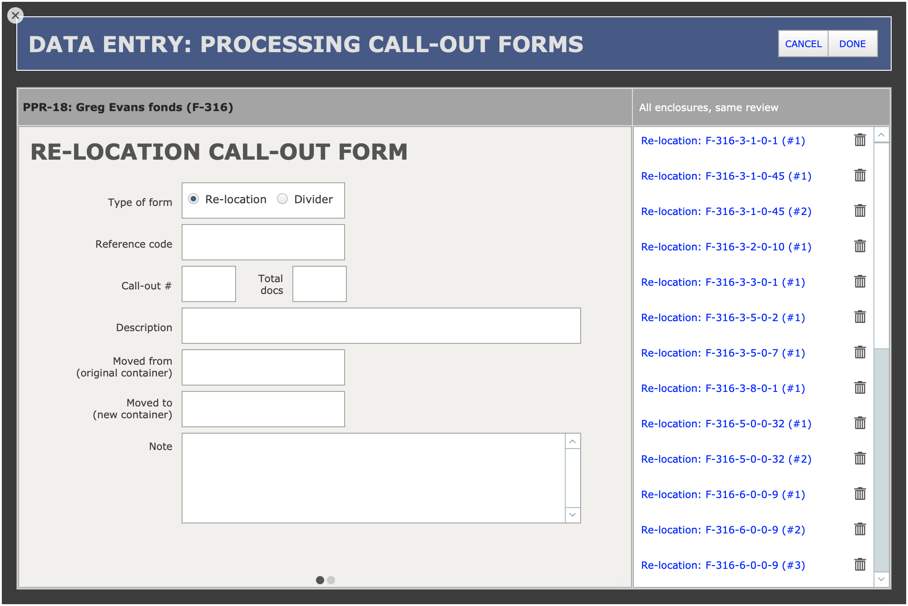
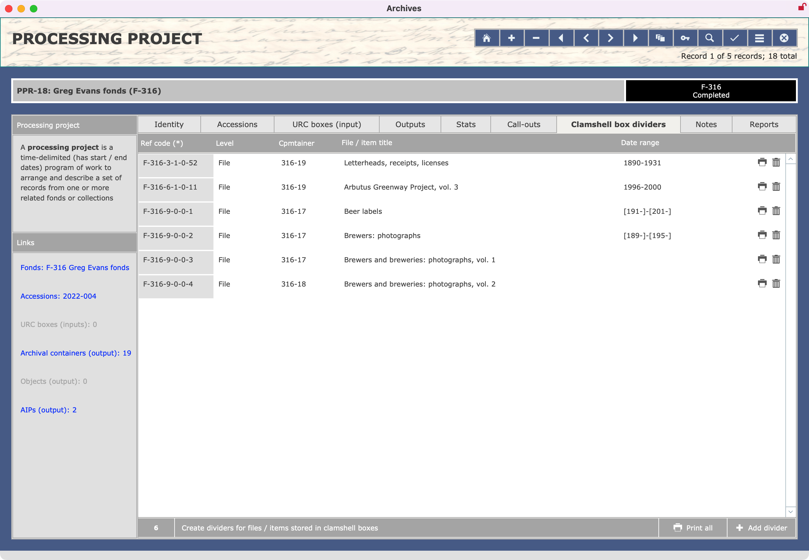
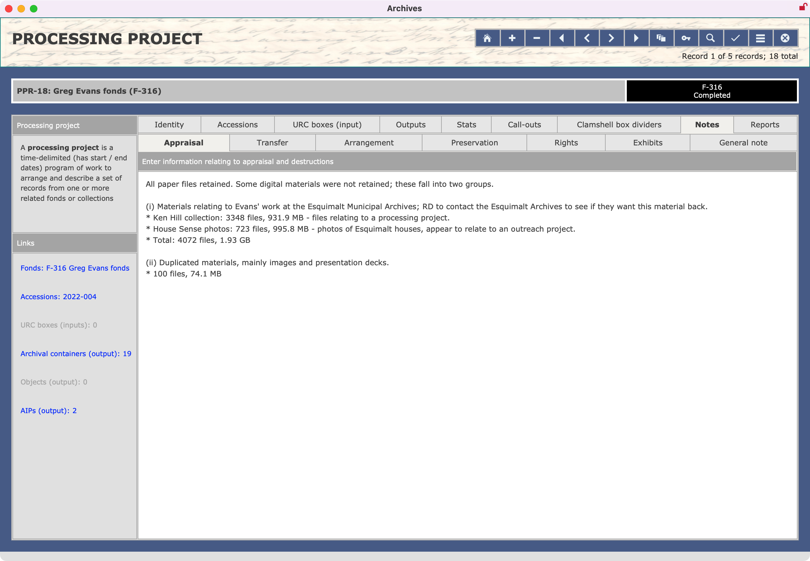
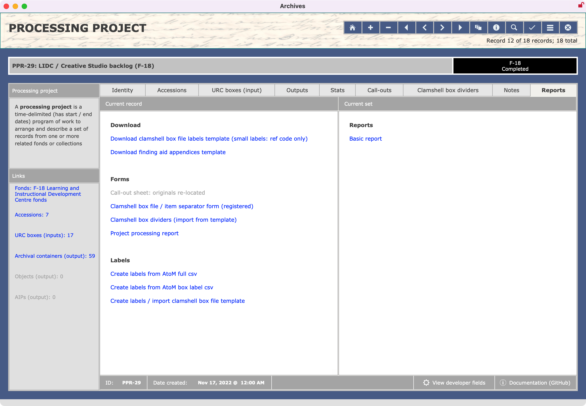

###### [AIS Documentation](../../README.md) > [Archives Module](../overview.md)
###### [Accessions](../accession/overview.md) `|` [Block Reviews](../block-review/overview.md) `|` [Fonds](../fonds/overview.md) `|` [Informal Access Reviews](../informal-access-review/overview.md) `|` [Inquiries](../inquiry/overview.md) `|` Processing Projects `|` [Research Products](../research-product/overview.md)
###### [Overview](overview.md) `|` [Create new records](create-new-record.md) `|` Edit records `|` [Reports and actions](reports-actions.md) `|` [DB structure](db-structure.md)

# Processing Projects: Edit Records
The `ProcessingProject` record **View** screen is organized into 9 tabs.
- [Identity](#identity-tab)
- [Accessions](#accessions-tab)
- [URC Boxes (input](#urc-boxes-input-tab)
- [Outputs](#output-tab)
- [Stats](#stats-tab)
- [Call-outs](#call-outs-tab)
- [Clamshell box dividers](#clamshell-box-dividers-tab)
- [Notes](#notes-tab)
- [Reports](#reports-tab)

## Identity tab
The **Identity tab** provides in the centre pane fields for describing the project; and in the right sidebar statistical summary fields.

`Processing project ID`
- Unique serial number automatically assigned by the database on record creation in the form "PPR-x".
- Field cannot be directly edited and should not be changed, as it is used to establish relationship to records in other database tables.

`Fonds affected`
- List all fonds processed as part of the project.
- Enter the full fonds number, including F- prefix.
- Typically only applies to one fonds, but there can be several, e.g. if the archivist decides that an accession in fact includes records that belong in different fonds.
- If there are multiple fonds, use commas to separate entries, e.g. "F-10, F-291".

`Accessions`
- List all accessions processed by the project.
- Enter the number in the form "YYYY-NNN".
- If there are multiple accessions, use commas to separate entries.

Click the `Edit` icon (pencil) for an interface that allows you to select / add accessions.
- The popover shows all unprocessed `Accessions` registered to the fonds listed in `Fonds affected` field.
- Select an `Accession` and it will be added to the list.
- Greyed out entries have already been added.

`Description`
- Provide a brief description of the project.

`Archivist responsible`, `Date started`, `Date completed`, `Status`
- Name of the Archives' staff responsible for processing project.
- `Status` of the project is either "In progress" or "Completed".
- Click the `Mark Completed` button to set `Status` ("Completed") and `Date completed` (current date).

`Statistical summary fields` (sidebar)
- The sidebar on the right shows a high-level summary, comparing extent received with final outputs for both analog and digital records.
- These totals derive from the values registered on the **Stats** tab.

 

## Accessions tab
The **Accessions** tab displays in table form all `Accessions` that were listed in the `Accessions` field on the **Identity** tab.

The `Status` and `Date processed` columns can be directly edited to update the `Accession` record.
- When you process materials from an `Accession`, you must update the Accession's `Status` field.

`Status`
- Indicate whether the `Accession` has been partially or fully processed.

`Date`
- Enter the date the `Accession` was processed.

 
## URC Boxes (input) tab
The **URC boxes (input)** tab shows all `URCBoxes` registered to the `Accessions` that were listed in the `Accessions` field on the **Identity** tab.

`Remove boxes`
- Click the red `X` in the `Remove` column to register the removal of backlog boxes that were processed as part of the project.
- When a box has been removed, it will be greyed out in the list.

Removal updates a number of fields in different database tables:
- An `End date` is added to the `Holding` record to retain the box's location history.
- The `Status` of the `Location` record is changed to "Available", freeing it up to receive new boxes.
- The `Processing project ID` is added to the `URCBox` record to link the box to the project.
- Several status fields in the `URCBox` record are updated: `Lifecycle` (="Removed"); `Workflow` (="Processed"); `Removed by` (=current user); and `Removed date` (=current date).

**If you mistakenly remove a box and want to restore it,** you need to manually update a number of different fields to restore the original data.

From the list of `URCBoxes`, click the `Box ID` of the box you want to restore. This will take you to the full `URCBox` record.

On the **Identity** tab of the `URCBox` record:
- Change `Workflow` to "Shelved".
- Change `Lifecycle` to "Backlog

On the **Workflow** tab of the `URCBox` record:
- Clear the `Processing Project ID` field.
- Clear the `Permanently removed date / by` fields.

On the **Location** tab of the `URCBox` record, click the `Edit` icon (pencil) of the location you want to restore.
- In the popover window, clear the `Date removed from location` and `Staff` fields.
- Click the `Close` button to close the popover.

Click the `Location` field in the list to navigate to the `Location` record.
- On the **Identity** tab of the `Location` record, update the `Status` field if required (e.g. change to "Full").
Update stats

 
## Outputs tab

Use the **Outputs** tab to create new archival `Containers`, `Objects` and `AIPs` as outputs of the processing project.

You can create these new records from their respective AIS tables / screens, but by creating them here they will be linked automatically to the processing project and allow you to easily generate processing stats.

From the Add sub-tab, select the `Primary fonds` and `Primary accession`.
- These values will be used in the new `Containers`, `Objects` and `AIPs`.
- The drop-down list is generated from the values you entered in the fields on the **Identity** tab.

Click the blue link for the type of new record you want to create (container, objects, AIPs).
- You will be routed to the appropriate **Data entry** screen.
- For more information on fields, see the guidance for each record type.

The sidebar on the right shows the total numbers of related records already created and linked to the project.

 
## Stats tab

 
## Call-outs tab

 
## Clamshell box dividers tab

 
## Notes tab

 
## Reports tab

###### Last updated: Aug 10, 2023
