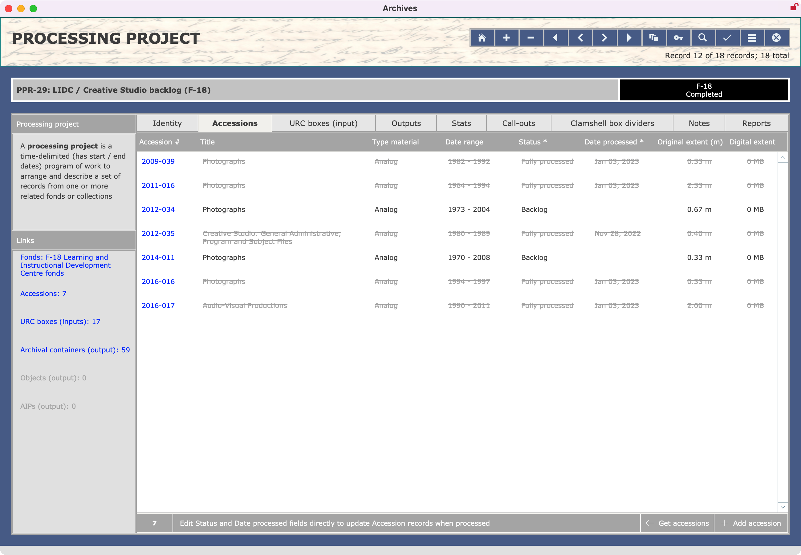

###### [AIS Documentation](../../README.md) > [Archives Module](../overview.md)
###### [Accessions](../accession/overview.md) `|` [Block Reviews](../block-review/overview.md) `|` [Fonds](../fonds/overview.md) `|` [Informal Access Reviews](../informal-access-review/overview.md) `|` [Inquiries](../inquiry/overview.md) `|` Processing Projects `|` [Research Products](../research-product/overview.md)
###### [Overview](overview.md) `|` [Create new records](create-new-record.md) `|` Edit records `|` [Reports and actions](reports-actions.md) `|` [DB structure](db-structure.md)

# Processing Projects: Edit Records
The `ProcessingProject` record **View** screen is organized into 9 tabs.

## Identity tab

The **Identity tab** provides in the centre pane fields for describing the project; and in the right sidebar statistical summary fields.

`Processing project ID`
- Unique serial number automatically assigned by the database on record creation in the form "PPR-x".
- Field cannot be directly edited and should not be changed, as it is used to establish relationship to records in other database tables.

`Fonds affected`
- List all fonds processed as part of the project.
- Enter the full fonds number, including F- prefix.
- Typically only applies to one fonds, but there can be several, e.g. if the archivist decides that an accession in fact includes records that belong in different fonds.
- If there are multiple fonds, use commas to separate entries, e.g. "F-10, F-291".

`Accessions`
- List all accessions processed by the project.
- Enter the number in the form "YYYY-NNN".
- If there are multiple accessions, use commas to separate entries.

Click the `Edit` icon (pencil) for an interface that allows you to select / add accessions.
- The popover shows all unprocessed `Accessions` registered to the fonds listed in `Fonds affected` field.
- Select an `Accession` and it will be added to the list.
- Greyed out entries have already been added.

`Description`
- Provide a brief description of the project.

`Archivist responsible`, `Date started`, `Date completed`, `Status`
- Name of the Archives' staff responsible for processing project.
- `Status` of the project is either "In progress" or "Completed".
- Click the `Mark Completed` button to set `Status` ("Completed") and `Date completed` (current date).

`Statistical summary fields` (sidebar)
- The sidebar on the right shows a high-level summary, comparing extent received with final outputs for both analog and digital records.
- These totals derive from the values registered on the **Stats** tab.

## Accessions tab

The **Accessions** tab displays in table form all `Accessions` that were listed in the `Accessions` field on the **Identity** tab.

## URC Boxes (input) tab

## Outputs tab

## Stats tab

## Call-outs tab

## Clamshell box dividers tab

## Notes tab

## Reports tab

###### Last updated: Aug 10, 2023
