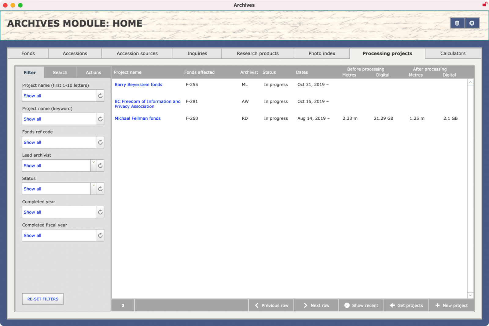

###### [AIS Documentation](../../README.md) > [Archives Module](../overview.md)
###### [Accessions](../accession/overview.md) `|` [Block Reviews](../block-review/overview.md) `|` [Fonds](../fonds/overview.md) `|` [Informal Access Reviews](../informal-access-review/overview.md) `|` [Inquiries](../inquiry/overview.md) `|` Processing Projects `|` [Research Products](../research-product/overview.md)

# Processing Projects
A `Processing Project` is a time-delimited program of work (has start / end dates) to arrange and describe a set of records from one or more related `Fonds` or `Collections`.

The main purposes of the AIS `Processing Project` table are to:
- Document archival processing activities and generate processing statistics.
- Provide an interface for managing the removal of processed `URC Boxes` and the creation of new `Containers`, `Objects`, and `AIPs`.
- Support the creation of standardized *Processing reports*, documenting decisions and issues relating to fonds and collections as they are arranged and described.

In this section:
- [Create new records](create-new-record.md)
- [Edit records](edit-record.md)
- [Reports and actions](reports-actions.md)
- [Database table structure](db-structure.md)

---

###### Last updated: Aug 8, 2023
